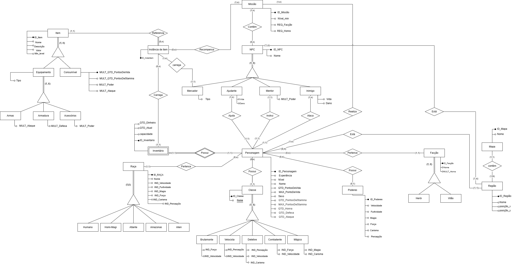

  ## Versionamento

|Data | Versão | Autor | Alterações | 
|:--:|:------:| :-----------------------------------------: | :--------: | 
|26/11/2022|  1.0   | [Iago Cabral](https://github.com/iagocabral), [João Victor](https://github.com/CorreiaJV),  [Matheus Soares](https://github.com/MtsSrs),  [Matheus Perillo](https://github.com/MatheusPerillo), [Vitor Manoel](https://github.com/Vitormanoel17)  | Criação do documento DER |
|26/11/2022|  1.1   | [João Victor](https://github.com/CorreiaJV),  [Matheus Soares](https://github.com/MtsSrs),  [Matheus Perillo](https://github.com/MatheusPerillo), [Vitor Manoel](https://github.com/Vitormanoel17) , [Iago Cabral](https://github.com/iagocabral) | Correção do documento DER | 
|27/11/2022|  1.2   | [João Victor](https://github.com/CorreiaJV) | Adição introdução DER | 
|16/01/2023|  1.3   | [Vitor Manoel](https://github.com/Vitormanoel17) | Correção do documento DER | 

# Diagrama Entidade-Relacionamento

O diagrama Entidade Relacionamento (DER) é composto por um conjunto de objetos gráficos que visa representar todos os objetos do modelo Entidade-Relacionamento tais como entidades, atributos, atributos chaves, relacionamentos, restrições estruturais, etc.

O diagrama fornece uma visão lógica do banco de dados, fornecendo um conceito mais generalizado de como estão estruturados os dados de um sistema.

 

 </img>

Figura 1: DER v.1.3

Fonte: Elaboração própria

