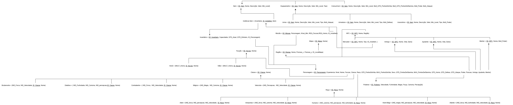
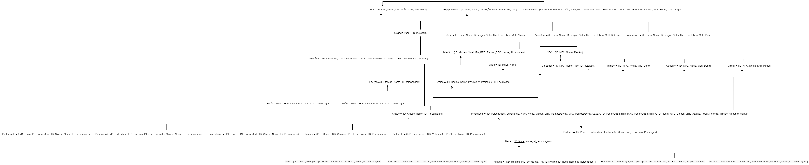
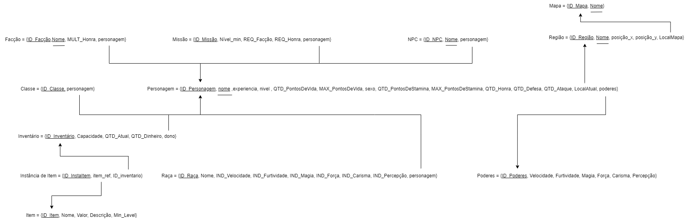
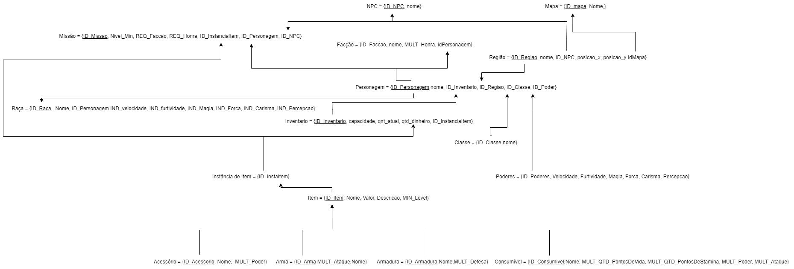

  ## Versionamento
  |Data|Versão|Autor|Alteração| 
  |----|------|---------|-----|
  |27/11/2022|1.0| [João Victor](https://github.com/CorreiaJV),  [Matheus Soares](https://github.com/MtsSrs), [Vitor Manoel](https://github.com/Vitormanoel17) , [Iago Cabral](https://github.com/iagocabral) | Versão Inicial do Modelo relacional(MREL)|
  |27/11/2022|  1.1   | [João Victor](https://github.com/CorreiaJV) | Adição introdução do documento | 
  |27/11/2022| 1.2| [Matheus Soares](https://github.com/MtsSrs),  [Matheus Perillo](https://github.com/MatheusPerillo) | Construção da segunda versão do MREL |
  |13/01/2023| 1.3| [Matheus Soares](https://github.com/MtsSrs) | Construção da terceira versão do MREL |
  |13/01/2023| 1.4| [Matheus Perillo](https://github.com/MatheusPerillo), [Vitor Manoel](https://github.com/Vitormanoel17) | Construção da quarta versão do MREL normalizado |
# Modelo Relacional
 O Modelo Relacional(MREL) apresenta um diagrama lógico de como as entidades e seus devidos relacionamentos serão mapeados no bando de dados, por isso é um modelo não atrelado a nenhum tipo de sistema de gerenciamento de banco de dados (SGBD) específico. 

## 2. DER

### Versão 1.3 (atual)
 </img>

Figura 1: MREL v.1.3

Fonte: Elaboração própria

### Versão 1.2 
 </img>

Figura 1: MREL v.1.2

Fonte: Elaboração própria

### Versão 1.1
 </img>

Figura 2: MREL v.1.1

Fonte: Elaboração própria

### Versão 1.0
 </img>

Figura 1: MREL v.1.0

Fonte: Elaboração própria

